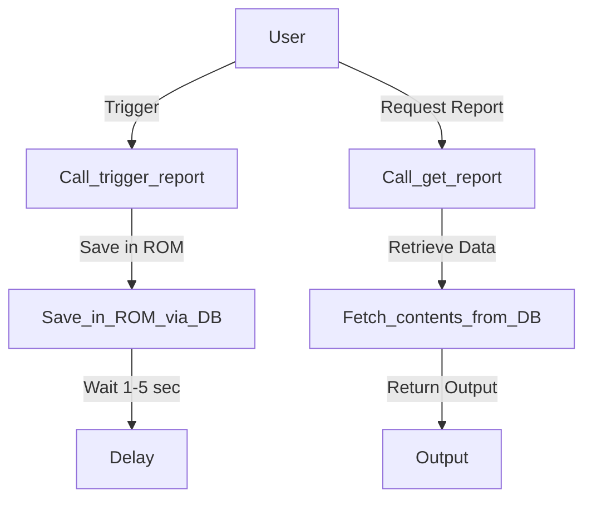
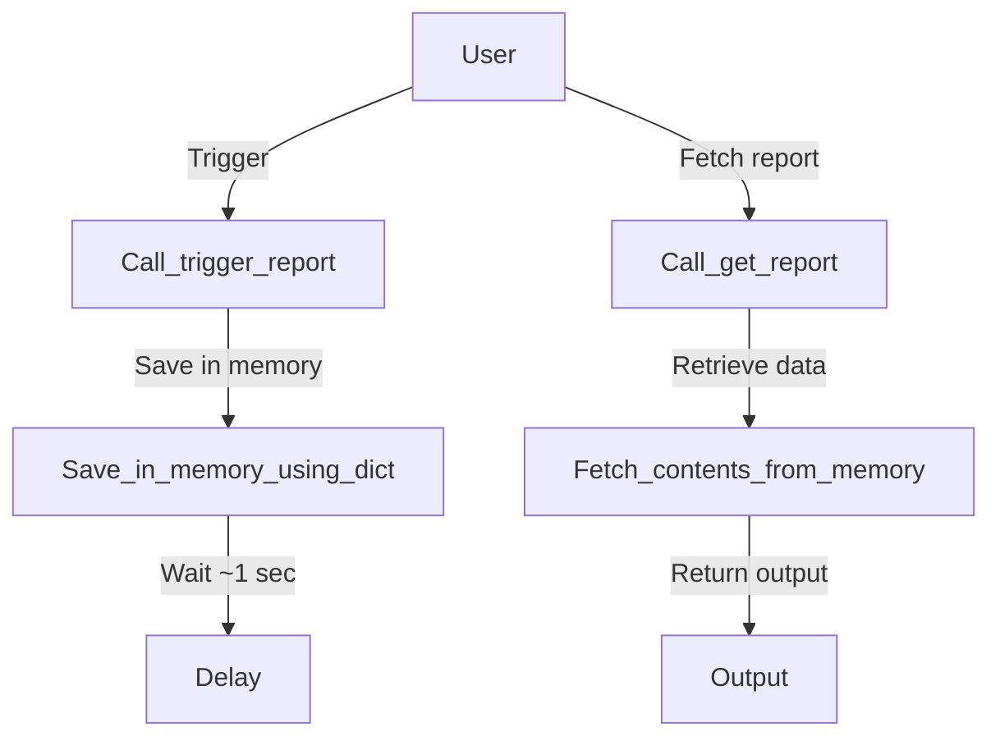

# Yashas_10-03-2025
## What it does 

A simple flask app with 2 triggering routes with redundant error handling. 

## Here is a comparison on how the data flows 

In the new code:



In the old code:



## API testing points

```http
   GET http://<ip>:<port>/trigger_report?store_id=<Store_ID>
```

| Parameter | Type     | Description                |
| :-------- | :------- | :------------------------- |
| `store_id`| `string` | **Required**. Store ID     |


```http
  GET https://<ip>:<port>/get_report?repid=<Report_ID>
```

| Parameter | Type     | Description                         |
| :-------- | :------- | :---------------------------------- |
| `repid`   | `string` | **Required**. Id of report to fetch |


## Potential Improvements

### Under New Code
1. Background tasks may become a hassle.

Better Approach : Using threads is a viable option ,but, task queues can be better for scalability and error handling.

2. Slow in terms of csv generation, 1-5 seconds wherein , the dictionary based in-memory csv storage is faster.

Better Approach : Usage of caching based database like redis for in-memory storage of data may help speeding up of csv generation. Dictionary based csv storage will be taxing on the RAM. 

3. Global states may become a potential bottleneck.

Better Approach : The global reports dictionary might become a source of race conditions. A tailored database table to track report states may work.

4. CSV generation (edge case handling) and Response headers.
    Adding more error checks and fallbacks under CSV generation and caching headers may work out if thread sharing is in play.


### Under Old Code

1. We manually call conn.close()
   
Better Approach : Use default cleanup of the python module, but redudndancy is specifically made to maintain consistency.

2. calctime() may be a bottleneck. Inefficiencies may be introduced if there are many requests in concurrency.
 
Better Approach : fetchmany(size) or usage of loop that goes through the table's rows is prefered (for humungous fetching).

3. Reports are stored in mem (reports dictionary). If the system runs for a long time or handles many reports, mem usage will grow.
 
Better approach: Store reports in a database table instead of a dictionary.

4. CSV data is kept in memory using (io.StringIO()). If reports get too large, memory can become an issue.
 
Better approach: Writing a temporary file on disk before giving it to the user.


# Why I Chose Flask Over Django

| Feature              | Django                    | Flask                          
|----------------------|---------------------------|--------------------------------|
| **Performance**      | Slower (heavy framework)   | Faster (lightweight)          |
| **Flexibility**      | Rigid        | Highly flexible               |
| **Database Handling**| Django ORM    | SQLAlchemy   |


