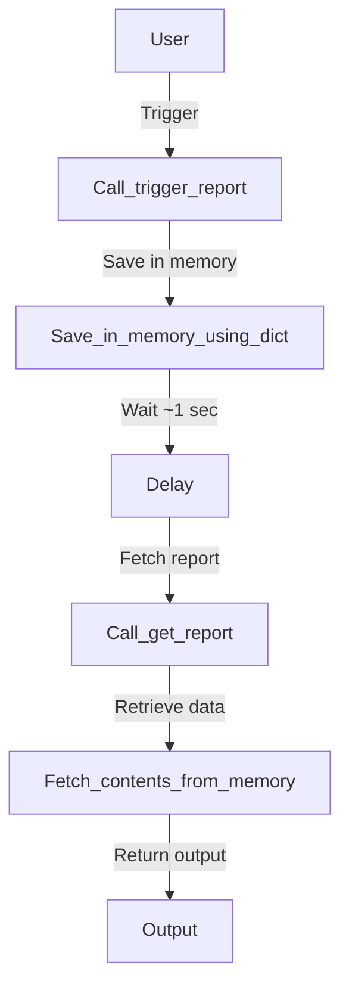

# Yashas_10-03-2025
## What it does 

A simple flask app with 2 triggering routes with redundant error handling. 

## Here is a comparison on how the data flows 
In the old code:


In the new code:
```mermaid
graph TD;
User--> Call /trigger_report;
Call /trigger_report--> Save in ROM via the db (persistence);
Save in ROM via the DB (persistence)--> Delay (~1-5sec);
Delay (~1-5sec)--> Call /get_report;
Call /get_report--> Fetch contents from DB;
Fetch contents from DB--> Output;
```

## API testing points

```http
   GET http://<ip>:<port>/trigger_report?store_id=<Store_ID>
```

| Parameter | Type     | Description                |
| :-------- | :------- | :------------------------- |
| `store_id`| `string` | **Required**. Store ID     |


```http
  GET https://<ip>:<port>/get_report?repid=<Report_ID>
```

| Parameter | Type     | Description                         |
| :-------- | :------- | :---------------------------------- |
| `repid`   | `string` | **Required**. Id of report to fetch |


## Potential Improvements


1. We manually call conn.close()
   
Better Approach : Use default cleanup of the python module, but redudndancy is specifically made to maintain consistency.

2. calctime() may be a bottleneck. Inefficiencies may be introduced if there are many requests in concurrency.
 
Better Approach : fetchmany(size) or usage of loop that goes through the table's rows is prefered (for humungous fetching).

3. Reports are stored in mem (reports dictionary). If the system runs for a long time or handles many reports, mem usage will grow.
 
Better approach: Store reports in a database table instead of a dictionary.

4. CSV data is kept in memory using (io.StringIO()). If reports get too large, memory can become an issue.
 
Better approach: Writing a temporary file on disk before giving it to the user.

